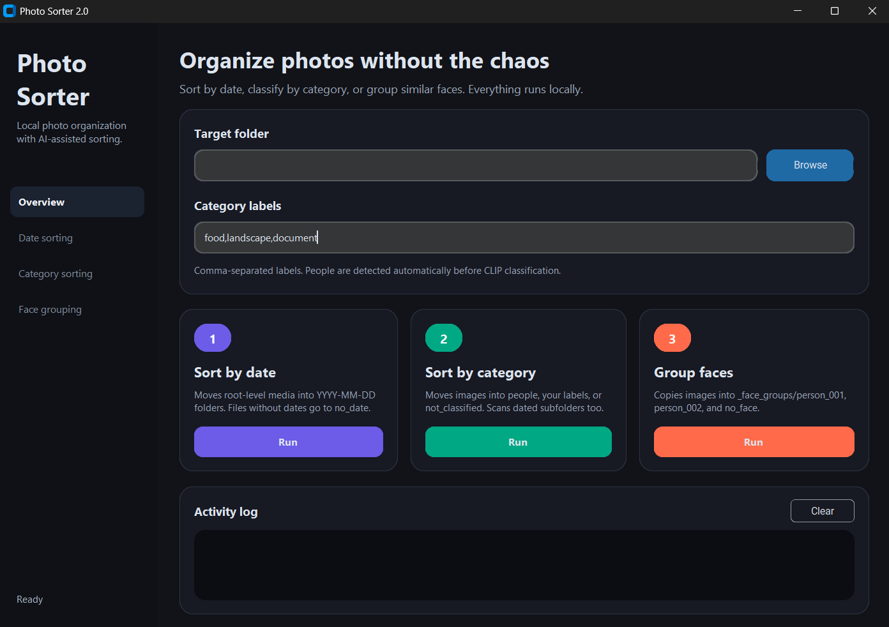

<p align="center">
  
</p>

<h1 align="center">Photo Sorter</h1>

<p align="center">
  一款本地端 Windows 桌面照片整理工具，可依日期、影像類別與相似人臉快速分類資料夾。
</p>

<p align="center">
  
  
  
  
</p>

---

## 專案簡介

**Photo Sorter** 是一款以隱私優先為核心的照片整理工具。它會在你的電腦本機處理照片，不需要把私人影像上傳到雲端服務。

這個工具特別適合整理從手機、相機或舊備份資料夾匯出的雜亂照片。你可以用它把檔案依照拍攝日期、照片內容類別，或相似人臉進行分組。

## 核心功能

| 功能 | 說明 | 檔案行為 |
| --- | --- | --- |
| 依日期整理 | 讀取 EXIF、檔案時間或媒體時間，建立 `YYYY-MM-DD` 資料夾 | 移動檔案 |
| 依類別整理 | 先偵測人物，再依自訂類別如 `food, landscape, document` 分類 | 移動檔案 |
| 相似人臉分組 | 使用人臉特徵把照片複製到 `person_001`、`person_002` 等群組 | 複製檔案 |
| 無法判斷處理 | 沒有日期會進入 `no_date`，無法分類會進入 `not_classified` | 自動歸檔 |

## 使用模型

| 用途 | 模型 |
| --- | --- |
| 人物偵測 | `facebook/detr-resnet-50` |
| 圖片零樣本分類 | `openai/clip-vit-large-patch14` |
| 人臉偵測與辨識 | `InsightFace buffalo_l` |

> 模型權重不會提交到 GitHub。首次執行相關功能時，程式可能會從 Hugging Face 或 InsightFace 下載模型快取。

## 安裝

建議使用 **Python 3.11 或以上版本**。

```powershell
python -m venv .venv
.\.venv\Scripts\Activate.ps1
python -m pip install --upgrade pip
python -m pip install -r requirements.txt
```

## 從原始碼執行

```powershell
python photo_sorter_ctk.py
```

專案也保留了基本 Tkinter 版本：

```powershell
python photo_sorter_app.py
```

## 使用方式

1. 選擇或貼上要整理的照片資料夾路徑。
2. 如需依類別整理，可輸入分類清單，例如：

```text
food, landscape, document
```

3. 選擇其中一個功能開始整理：

| 按鈕 | 適合情境 |
| --- | --- |
| Sort by Date | 想先把照片依拍攝日期分好 |
| Sort by Category | 想把人物、食物、風景、文件等內容分開 |
| Group Similar Faces | 想把相似人物照片分組，方便後續人工確認 |

> 建議先用複製出來的測試資料夾執行，確認分類結果符合需求後，再處理重要原始照片。

## 建立 Windows EXE

安裝 PyInstaller：

```powershell
python -m pip install pyinstaller
```

建立可執行版本：

```powershell
pyinstaller --noconfirm PhotoSorterTool.spec
```

輸出位置：

```text
dist/PhotoSorterTool/PhotoSorterTool.exe
```

PyInstaller 的 `onedir` 模式會產生一個完整資料夾。發佈時請保留整個 `PhotoSorterTool` 資料夾，不要只複製單一 `.exe`。

## 模型與大型檔案

此 repository 不包含模型權重、EXE、build output 或大型快取檔案。這些檔案已透過 `.gitignore` 排除。

常見本機模型快取位置：

```text
C:\Users\<you>\.cache\huggingface\hub
C:\Users\<you>\.insightface\models
```

如果要製作離線版本，可自行把模型放入 release package，但不建議提交到 GitHub repository。

## 專案結構

```text
photo-sorter/
├─ photo_sorter_ctk.py      # 主要 CustomTkinter 介面
├─ photo_sorter_app.py      # 基本 Tkinter 備用版本
├─ PhotoSorterTool.spec     # PyInstaller 打包設定
├─ requirements.txt         # Python 依賴套件
├─ app.png                  # README 截圖
├─ .gitignore               # 忽略 build、exe、模型與快取
└─ README.md
```

## 授權

MIT License
